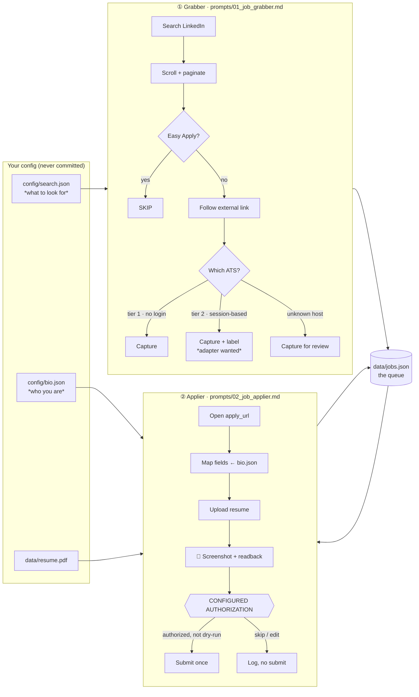

<div align="center">

# 🔗 linkedin-claude-connector

**Find jobs on LinkedIn. Apply on the employer's ATS under your chosen approval policy.**

A free, open-source agent harness that pairs **Claude Code** and **Claude Cowork** with
your own browser to discover external job postings on LinkedIn and fill out
applications on **Greenhouse, Ashby, Lever, and BambooHR**. Batch review is the default;
individual approval and explicitly configured automatic submission are also supported.

[](LICENSE)
[](#-the-human-in-the-loop-gate)
[](#-scope)
[](CONTRIBUTING.md)

</div>

---

## Why this exists

Mass-apply bots are a bad deal for everyone. They spray low-quality applications,
they get accounts banned, and they hand a stranger's script your personal data.

This project takes the opposite position:

- **You set the approval policy.** Review each application, review a batch, or explicitly
  configure automatic submission of eligible rows. Every submission has a saved readback.
- **Private files stay out of Git.** Your bio, resume, queue, and run artifacts are
  gitignored. The agent/browser processes data and sends application data to employers.
- **Existing browser access only.** The shipped adapters handle public forms. No credential entry,
  no CAPTCHA solving, no account creation, no LinkedIn Easy Apply.
- **Generic by construction.** The prompts know nothing about you. Your
  `config/search.json` and `config/bio.json` decide everything — the same repo works
  for a Summer 2027 internship hunt or a senior backend search.

It is a **tedium remover**, not an application cannon.

---

## 🎯 Scope

Platforms are organized in **tiers**, and the tier list is a scope setting you can
widen — not a fixed boundary.

| Tier | Meaning | Status |
|---|---|---|
| **Tier 1** | Public application form, no sign-in | ✅ Greenhouse · Ashby · Lever · BambooHR |
| **Tier 2** | Needs a session **you** signed into — the agent works inside it, never creates it | 🚧 Open. Workday, iCIMS, SmartRecruiters, Jobvite and others are [wanted contributions](docs/ROADMAP.md) |
| **White-label** | The employer's own domain wrapping one of the above | 🔎 Resolved one hop during discovery; applyable when the underlying vendor is supported |
| **Conversational** | Chatbot apply (Paradox/Olivia, "Chat To Apply") | ⏭️ Captured and skipped — a dialogue has no field readback or pre-submit gate |
| **Unknown** | Unrecognized host | 📋 Captured and logged, so recurring ones surface as adapter candidates |

Discovery captures **all** tiers by default; `ats_capture` can narrow that scope.
Application routing uses enabled, implemented adapters. Later adapters can reactivate
explicit no-adapter skips; applied jobs and deliberate user skips remain unchanged.

**What the agent never does**, at any tier or autonomy level: enter credentials, create
accounts, solve or bypass CAPTCHAs, evade rate limits, supply an SSN / government ID /
payment details, or fabricate a fact on an application. Note that these constrain the
*agent's behavior* — none of them names a platform.

**LinkedIn Easy Apply** is excluded by design: the point is to reach the employer's own
ATS, where applications are actually read. That's a design decision, not a rule — open
an issue if you disagree.

---

## 🏗️ Architecture

Two agents, one file between them. That is the whole design.



**Why a file in the middle?** Discovery and application are separate human decisions,
separated by a durable, inspectable artifact. You can open `data/jobs.json` in an
editor, delete the jobs you do not want, and only then start applying. Nothing is
hidden in an agent's head.

---

## 📁 Repository layout

```
linkedin-claude-connector/
├── README.md                      ← you are here
├── CLAUDE.md                      ← developer guide for agents working ON this repo
├── LICENSE                        ← MIT
├── .gitignore                     ← hard-blocks bio.json, resume.pdf, jobs.json
│
├── config/
│   ├── bio.template.json          ← copy → bio.json, then fill in (PII, gitignored)
│   └── search.template.json       ← copy → search.json, then set your queries
│
├── prompts/
│   ├── 01_job_grabber.md          ← steering file: LinkedIn discovery → jobs.json
│   └── 02_job_applier.md          ← jobs.json → filled forms → configured authorization
│
├── data/
│   ├── jobs.example.json          ← the output schema, with samples
│   ├── jobs.json                  ← 🔒 generated queue (gitignored)
│   ├── resume.pdf                 ← 🔒 your resume (gitignored)
│   └── screenshots/               ← 🔒 review + confirmation captures (gitignored)
│
├── scripts/
│   └── validate.py                ← offline sanity checks on your config & queue
│
└── docs/
    ├── ATS_NOTES.md               ← per-platform form quirks
    ├── ROADMAP.md                 ← open problems & wanted contributions
    └── SAFETY.md                  ← the guarantees, stated plainly
```

---

## 🚀 Setup

### Prerequisites

- [Claude Code](https://claude.com/claude-code) or **Claude Cowork** (desktop app)
- A browser the agent can drive — the **Claude in-app browser** or **Claude in Chrome**
- Python 3.9+ (only for the optional `scripts/validate.py`)
- A LinkedIn account **you are already signed into in that browser**

### 1. Clone

```bash
git clone https://github.com/<your-username>/linkedin-claude-connector.git
cd linkedin-claude-connector
```

### 2. Create your private config

Upgrading an existing checkout? Follow [UPGRADING.md](docs/UPGRADING.md) for schema
`2.0.0`; preserve your private answers, operating policy, and application history.

```bash
cp config/bio.template.json  config/bio.json
cp config/search.template.json config/search.json
```

Open `config/bio.json` and replace every value with your own.

> **Leave a field as `"ASK_ME"` on purpose** for anything you want to answer by hand
> each time. Required unresolved answers quarantine by default; `BLOCK_AND_ASK` asks
> during the run. Optional fields may remain blank. No missing fact is invented.

Then set your targeting in `config/search.json`:

```jsonc
{
  "queries": ["Software Engineer Intern Summer 2027"],
  "locations": ["United States"],
  "linkedin_filters": { "date_posted": "PAST_WEEK", "experience_level": ["INTERNSHIP"] },
  "exclude_keywords": ["senior", "clearance required"]
}
```

### 3. Add your resume

```bash
cp /path/to/your/resume.pdf data/resume.pdf
```

### 4. Confirm nothing private can be committed

```bash
git check-ignore -v config/bio.json data/resume.pdf data/jobs.json
```

All three must print a matching `.gitignore` rule. If any does not — **stop** and fix
it before your first commit.

Optional deeper check:

```bash
python3 scripts/validate.py
```

---

## ▶️ Running it

### Phase 1 — Grab jobs

Open the repo in Claude Code / Cowork with a browser attached, then:

```
Read prompts/01_job_grabber.md and follow it using config/search.json.
```

The agent will search LinkedIn, scroll and paginate, skip every Easy Apply posting,
follow the "Apply on company website" links, classify the destination ATS, and write
`data/jobs.json` — checkpointing every 10 cards.

It ends with a summary and **stops**. It will not start applying on its own.

```
── Discovery complete ──────────────────────────────
LinkedIn cards seen   : 118
External ATS captured : 24   → greenhouse 11 · ashby 6 · lever 5 · bamboohr 2
Easy Apply skipped    : 71
Account-required skip : 19
────────────────────────────────────────────────────
```

### Phase 2 — Curate (recommended)

Open `data/jobs.json` yourself. Delete anything you do not actually want. Set
`"status": "skipped"` on the maybes. This one minute is the highest-leverage step in
the whole workflow.

### Phase 3 — Apply

```
Read prompts/02_job_applier.md and work the queue in data/jobs.json.
Start in dry-run for the first three.
```

For each job the agent maps `bio.json` onto the form, uploads your resume, and writes
a readback and screenshots. The default `BATCH_REVIEW` presents one sheet after filling
up to 12 forms. With `SUPERVISED`, the individual review looks like this:

```
── REVIEW: Example Labs — Software Engineer Intern, Summer 2027 ──
  Name       : Jordan Rivera
  Email      : jordan.rivera.example@gmail.com
  Resume     : Jordan_Rivera_Resume.pdf ✓ uploaded
  Work auth  : Authorized: Yes · Requires sponsorship: No
  EEO fields : Prefer not to say (5 fields, unchanged)
  Left blank : Cover letter (optional)
────────────────────────────────────────────────────────────────
Submit this application? (yes / edit <field> / skip / stop run)
```

Answer `yes` and it submits **once**, captures the confirmation, and moves on.
Answer anything else and it does not.

---

## 🛡️ The Human-in-the-Loop gate

The agent runs at whatever autonomy you set — including fully unattended. What does
**not** change with the dial is factual integrity:

> **Nothing is ever asserted to an employer that you did not state.**
> The agent writes prose. It does not invent facts. A row missing a required fact is
> set aside, never guessed.

That rule is what makes unattended submission defensible, so it holds at every level.

Set the dial with `agent_policy.autonomy_level`:

| Level | The agent | You review |
|---|---|---|
| `SUPERVISED` | Fills one form, stops | Each application, one at a time |
| `BATCH_REVIEW` **(default)** | Fills the whole batch uninterrupted, writes a review sheet | All of them, on one sheet |
| `TRUSTED_BATCH` | Same, but auto-approves rows where *every* field resolved cleanly from `bio.json` | Only the rows that needed a judgment call |
| `AUTOPILOT` | Submits eligible rows without approval prompts; unresolved answers follow escalation.mode | Full audit sheet after |

`TRUSTED_BATCH` auto-approves a row only if every required field came straight from
your config, nothing was drafted, nothing was substituted, the resume upload was
visually confirmed, and the company and title matched. A drafted cover letter, a
substituted dropdown, or a retried field routes that row to you.

A full readback of every application is written to `data/review/<run-id>.md` **before**
that application is sent — at every level, including `AUTOPILOT`. Nobody has to read
it, but what was sent is always reconstructable. `dry_run: true` disables submission
entirely at every level.

### Escalation: quarantine, don't interrupt

At high volume, "stop and ask" is the bottleneck. So it isn't the default —
`escalation.mode: "QUARANTINE_AND_CONTINUE"` is:

> When the agent hits something it can't resolve, it **parks that one job with a
> reason and keeps working the queue.** No message, no waiting. You get the pile at
> the end, with the exact fix for each.

A run of sixty produces exactly one message:

```
Submitted        : 38   (greenhouse 19 · ashby 11 · lever 6 · bamboohr 2)
Account required : 5    — expected, not errors

⚠ QUARANTINED — 3, none submitted, each needs one thing from you:
   Acme Robotics     required fact missing: years_of_experience_python
   Vertex Analytics  legal attestation not in config
   Helio Systems     identity mismatch — page showed "Senior Platform Engineer"
   Fix the first two in bio.json and they clear, along with future rows.
```

Access/config failures stop a run outright rather than ask because nobody may
be watching: a CAPTCHA, an expired required browser session, a request for an SSN or payment details, a
rate-limit warning, or a broken config. Failed audit or queue writes also stop before
submission. Other unresolved answers quarantine; closed postings are marked failed. If quarantines
pass `max_quarantined_before_abort`, the run aborts — that many failures means a
systemic problem, and burning the queue against it wastes the queue.

### What the agent handles on its own

No interruption for any of this — it is all reversible:

retrying dropped field input (React forms drop it constantly) · re-deriving a changed
page layout by role and label · picking an unambiguous dropdown match (`TX` → `Texas`) ·
**drafting cover letters and open-ended answers when enabled** from your resume, grounded only in
facts already in your config · filling optional fields from your resume · re-ordering
the queue by deadline · deduping and reclassifying · carrying
on past a dead posting.

Escalation is reserved for what is genuinely undecidable: a missing **fact** (a date, a
GPA, an authorization status), a legal attestation, or a hard boundary below.

### Defensive halts

| Situation | What the agent does |
|---|---|
| 🤖 **CAPTCHA** | **Stops the run**, checkpoints, reports how far it got. Never solves or bypasses one — no config flag opens this. |
| 🔐 **Sign-in wall** | LinkedIn auth → stops the run (never types credentials). An *application* sign-in wall → tier-2 handling: applied if you have that adapter enabled and are signed in, quarantined if you aren't, skipped if no adapter exists yet. |
| ❓ **Missing fact / legal attestation** | **Quarantines the row and continues.** Never guesses a checkable claim, at any autonomy level. |
| 🧭 **Layout drift** | Re-derives the layout by role and label, verifies against two cards, continues. Quarantines only if it can no longer tell Easy Apply from an external apply. |
| 🆔 **SSN / ID / payment request** | **Stops the run.** Never required to apply — a page asking is compromised or not an application form. |
| ⏱️ **Rate limit** | Checkpoints, reports, stops. Never tries to evade it. |

---

## 🔒 Privacy

Three files hold everything personal, and all three are blocked at the VCS boundary:

| File | Contains | Status |
|---|---|---|
| `config/bio.json` | Name, contact, address, work authorization, pay expectations | 🔒 gitignored |
| `data/resume.pdf` | Your resume | 🔒 gitignored |
| `data/jobs.json` | Your search results and application history | 🔒 gitignored |

Plus, defensively: `**/bio.json`, `**/resume.pdf`, `**/jobs.json`, `data/screenshots/`,
`.env`, and common credential filenames. This repo has no application server or telemetry.
Your configured agent service and browser process the content, and resume uploads and
application submissions send data to employers. Gitignore does not prevent those transfers
or detect personal data copied into public files. The validator scans tracked file content
against identifying bio values, including templates and staged content; it is not a general
detector for all sensitive data.

**Before your first push,** run `git status` and confirm none of those three appear.

---

## ⚖️ Responsible use

This tool automates a browser you control, using data you own, on public application
forms. That said:

- **You are responsible for every application submitted under your name.** Read the
  review block before you type `yes`.
- LinkedIn's Terms of Service restrict automated access. The agent behaves like a
  slow human — human-paced scrolling, no parallel scraping, no CAPTCHA evasion, no
  credential automation — but **you are accepting the risk to your own account.**
  Keep runs small.
- The template caps a run at 60 applications, in batches of 12, with at least 8 seconds
  between applications. Lower the cap for initial dry runs.
- Only enable implemented adapters. Session-based adapters remain future work and
  must use sessions you establish manually.

---

## 🤝 Contributing

PRs welcome, and there is real work available. **[docs/ROADMAP.md](docs/ROADMAP.md)**
has the open problems; the most valuable one is a **tier-2 adapter**.

Workday in particular is the largest coverage gap and a genuinely interesting design
problem: every employer is a separate tenant with a separate account, which breaks the
one-session-many-applications assumption every tier-1 adapter is built on. It also has
a real fact-integrity wrinkle — Workday pre-populates from a stored per-tenant profile
that may be stale, and reconciling that against your config before submitting is an
unsolved piece. Nobody has cracked it yet. The roadmap lays out the open questions.

Also wanted: discovery sources beyond LinkedIn, cross-source dedupe, non-US work
authorization modelling, a fixture-based replay harness, and accessibility work.

See [CONTRIBUTING.md](CONTRIBUTING.md) and the standards in [CLAUDE.md](CLAUDE.md).

**The short list of what a PR may not add:** credential entry, account creation,
CAPTCHA solving or bypass, rate-limit evasion, or fabricated facts on an application.
Those constrain the agent's behavior and nothing else — **widening platform coverage
is explicitly encouraged**, including to platforms this MVP skips.

---

## 📄 License

MIT — see [LICENSE](LICENSE). Free forever, for everyone.

<div align="center">
<sub>Built for job seekers who would rather spend their evening preparing than retyping their phone number for the fortieth time.</sub>
</div>
